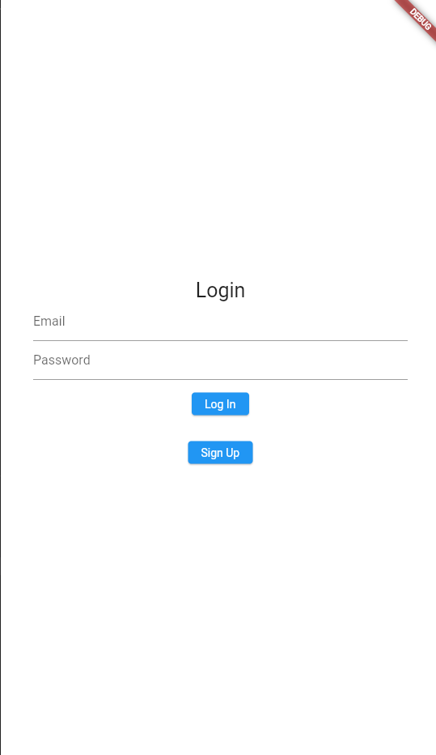
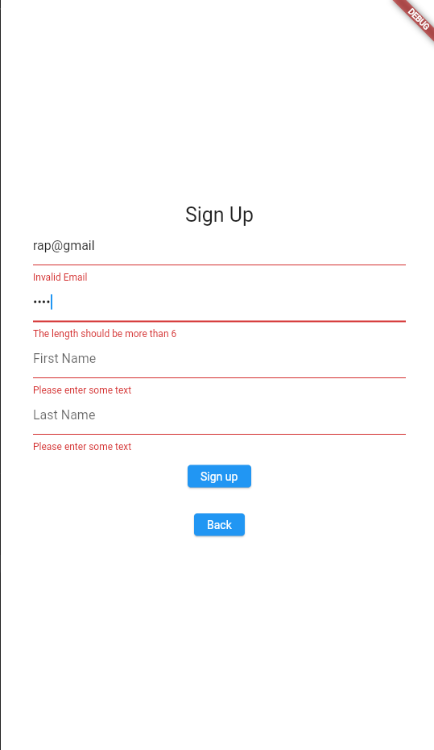

# User Authentication and Automated Tests
## Exer 7

## Student Information 
* Name : Raphael S. Vispo
* Strudent Number : 2021-10210
* Section : D3L

## App Description 
The app is a todo app with user Authentication. The authentication can also add users first name and last name in database. The app also supplies Test cases of 2 of each happy and unhappy paths.

## Screenshots

Log in screen 

Sign up screen showing the validation errors

## Things that you did in the code

For the validation, I used the the forms and the textFormfields. The email validation I used Regex. I also added an firstNAme and lastName when signing up the user, and this is stored in the database using the providers and firebase api.

## Challenges faced

* The validation of email  is difficult, i solved it by this [link](https://stackoverflow.com/questions/16800540/how-should-i-check-if-the-input-is-an-email-address-in-flutter)

## Test Cases

### Happy Paths

* Pluggin in the user's Email, firstName and Lastname in the database
* The validation of the different fields

### Unhapppy Paths
* Currently there is no found unhappy paths