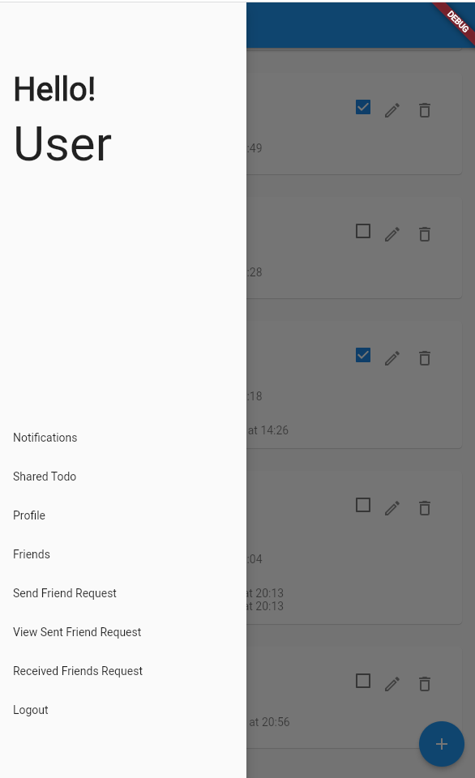

# Shared Todo App
## CMSC 23 Poject

## Student Information 
* Name : Raphael S. Vispo
* Strudent Number : 2021-10210
* Section : D3L

## App Description 
A todo app that uses CRUD methodologies, authentication and authorization. The App has a friends feature for sharing of the todos. The app also allows picking of freinds for sharing of the todos.

## Screenshots

Onced logged in:

#### Todo Page

#### Todo app drawer

clicking the hamburget icon from the Todo page

#### Friends

clicking the add icon from the todo page

####  UserProfile Todo
This shows the notifications of the user

## Things that you did in the code
* Friends feature: Add add Unfriend friends with friend request.
* Todo: the user can chooose the todo that will be share to. The user can only pick from there friends list
* Notification: There will ba a notification page that will be shown. THe deadline nearing, Accepted friend request and the edited todos

## Challenges faced
* challenges face include getting the user's id form the data base
* Understanding Streams and Future builder.

## Test Cases
### Happy Paths
* Get if the widget exist for the  log in and sign up
* If all of the user's input are valid

### Unhapppy Paths
* having null nad invalid input for the login and sign up page